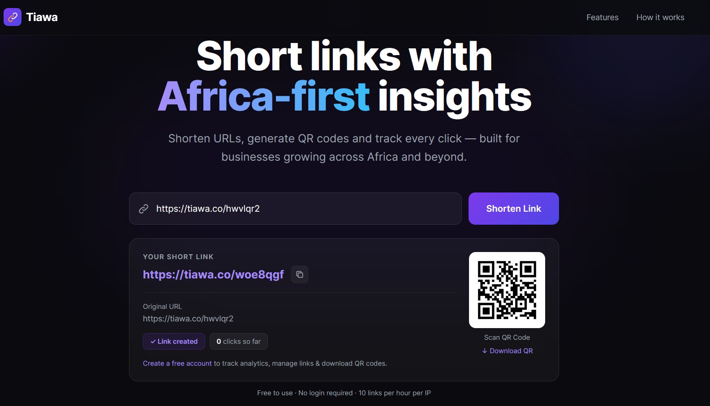
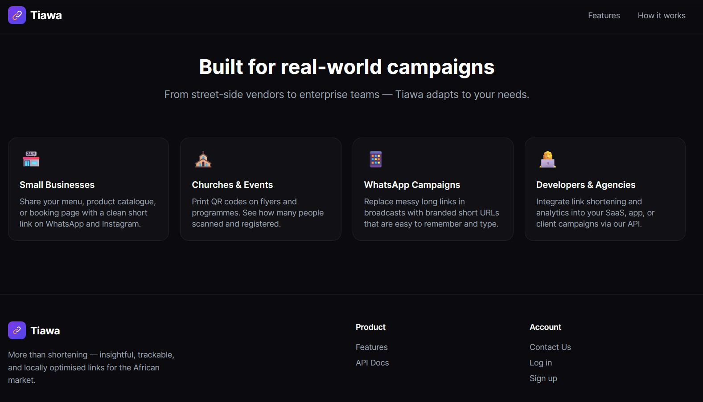

<p align="center">
  
</p>

# Tiawa — Smarter Short Links for Africa

> Shorten URLs, generate QR codes, and track every click — built for businesses growing across Africa and beyond.

Tiawa is a modern link management platform that turns long, unwieldy URLs into clean, shareable short links — instantly, with no login required. Every link comes with a free QR code and, for registered users, powerful click analytics to understand exactly who is engaging with your content and from where.

---

## ✨ Key Features

- **Instant URL Shortening** — Convert any long URL into a compact short link in under a second. No account needed to get started.
- **QR Code Generation** — Every short link automatically gets a scannable QR code, ready to share digitally or print on physical materials.
- **Click Analytics** — Track every click with device type, browser, time of day, and geographic location data (available on registration).

- **Rate-Limited & Fair** — Free usage is IP-limited to 10 links per hour to keep the service fast and available for everyone.
- **Developer API** — Integrate link shortening and analytics directly into your SaaS, app, or client campaigns.

---

## 🖥️ The Interface

The landing page gives any visitor immediate access to the URL shortener — no sign-up friction, no paywall. Paste a long URL, click **Shorten Link**, and within a second you have:

- A short link (e.g. `https://tiawa.co/woe8qgf`) ready to copy
- A downloadable QR code alongside it
- A prompt to create a free account for full analytics

<p align="center">
  
  <br>
  <em>Paste any URL, get a short link and QR code instantly — no login required.</em>
</p>

---

## 🚀 How to Use Tiawa

### Step 1 — Paste your URL

Navigate to the Tiawa homepage. In the input field at the centre of the page, paste any long URL — a product page, booking form, social media profile, event registration, or campaign landing page.

### Step 2 — Click "Shorten Link"

Hit the **Shorten Link** button. Within milliseconds, a result card appears below the form showing:

- Your new **short URL** (click to open, or use the copy button)
- The **original URL** for reference
- A **QR code** panel on the right — click **↓ Download QR** to save it as an SVG file

### Step 3 — Share & track

Copy the short link and share it anywhere — WhatsApp broadcasts, Instagram bios, printed flyers, email campaigns, or SMS. To unlock full click analytics, device stats, and link management, create a free account.

---

## 🌍 Built for Real-World Campaigns

<p align="center">
  
  <br>
  <em>From street-side vendors to enterprise teams — Tiawa adapts to every campaign type.</em>
</p>

| Who | How they use Tiawa |
|-----|--------------------|
| 🏪 **Small Businesses** | Share menus, product catalogues, or booking pages with a clean short link on WhatsApp and Instagram |
| ⛪ **Churches & Events** | Print QR codes on flyers and programmes; see how many people scanned and registered |
| 📱 **WhatsApp Campaigns** | Replace messy long links in broadcasts with short, branded URLs that are easy to remember |
| 👩‍💻 **Developers & Agencies** | Integrate link shortening and analytics into SaaS products or client campaigns via the API |

---

## 📊 Platform Stats

| Metric | Value |
|--------|-------|
| Links Shortened | 10,000+ |
| Clicks Tracked | 50,000+ |
| Countries Reached | 15+ |
| Uptime | 99.9% |

---

## 🛠️ Tech Stack

<!-- - **Backend:** Laravel (PHP) -->
- **Frontend:** Laravel Blade templates, Alpine.js, Tailwind CSS
- **Build tool:** Vite
- **QR generation:** Server-side SVG
- **Database:** MySQL / compatible

---

## ⚙️ Local Development Setup

```bash
# 1. Clone the repository
git clone <repo-url>
cd tiawa

# 2. Install PHP dependencies
composer install

# 3. Install JS dependencies
npm install

# 4. Copy environment file and configure your DB & APP_URL
cp .env.example .env
php artisan key:generate

# 5. Run migrations
#php artisan migrate

# 6. Start the development server
php artisan serve

# 7. In a separate terminal, compile assets
npm run dev
```

Visit `http://localhost:8000` in your browser.

---

## 📄 License

Proprietary — all rights reserved. Contact the project owner for licensing enquiries.

